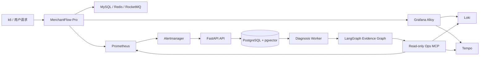

# AIOps Incident Agent

面向容器化业务系统的证据驱动故障诊断 Agent。首个真实目标是相邻仓库 [MerchantFlow-Pro](https://github.com/haoyundd/MerchantFlow-Pro)：Prometheus、Loki、Tempo 和健康检查采集实际运行信号，Alertmanager 创建 Incident，LangGraph 对多个根因假设逐项取证，最终输出可追溯的结论或明确的 `INCONCLUSIVE`。

本项目不把“接口返回预设错误”当作真实诊断。单元测试可以使用 Fake 工具，演示与评测使用 k6 真实流量、容器 CPU 配额以及 Toxiproxy TCP 延迟/中断。

## 系统链路



## 已实现能力

- PostgreSQL 持久化 Incident、事件、诊断任务、假设、证据、工具调用、审批与审计；pgvector 保存 Runbook 分块。
- API 与 Worker 分离，Worker 使用数据库队列和 `FOR UPDATE SKIP LOCKED` 领取任务。
- LangGraph PostgreSQL Checkpointer；SQLite 仅作为无 Docker 的本地测试后备。
- 指标、日志、Trace、健康检查统一成带风险、超时、重试和查询上限的只读工具契约。
- 根因假设只根据已采集证据打分；至少两个数据源可用且置信度达到阈值才给出确定结论。
- `viewer / operator / admin` 三角色 JWT 权限；Alertmanager 支持共享密钥或 HMAC。
- MerchantFlow 永久只读；仅在双开关启用的隔离 lab 中执行固定 action ID，并在执行后验证真实健康状态。
- 事件工作台、证据轨道、时间线、Incident 追问和 Runbook 管理。
- 3 类 15 个真实故障评测案例及可重复计算的评测脚本。

## 目录

```text
app/api/v1/              版本化 API、JWT 与 RBAC
app/agent/evidence_graph.py
                         证据采集、假设排序和报告工作流
app/observability/       Prometheus/Loki/Tempo/health 只读适配器
app/services/            Incident、Runbook、审批和恢复服务
mcp_servers/ops_server.py
                         统一只读 Ops MCP 服务
observability/           Prometheus、Alertmanager、Loki、Tempo、Alloy、Grafana
evaluation/              15 个真实故障案例及结果格式
static/                  原生 ES Modules 事件工作台
alembic/                 PostgreSQL/pgvector 数据迁移
```

## 本地启动

### 1. 准备两个相邻仓库

```text
yunwei/
├─ haoyundd/
└─ MerchantFlow-Pro/
```

### 2. 配置密钥

两个仓库都没有可用默认密码：

```powershell
Copy-Item .env.example .env
Copy-Item ..\MerchantFlow-Pro\.env.example ..\MerchantFlow-Pro\.env
```

至少填写：

- AIOps：`POSTGRES_PASSWORD`、`JWT_SECRET`、`ADMIN_PASSWORD`、`ALERTMANAGER_WEBHOOK_SECRET`、`GRAFANA_ADMIN_PASSWORD`。
- MerchantFlow：`MYSQL_PASSWORD`、`REDIS_PASSWORD`、`AKSK_ACCESS_KEY`、`AKSK_SECRET_KEY`。
- LLM Key 可暂不填写；服务、告警、页面、数据库和确定性诊断仍能启动，只有聊天与 Embedding 返回清晰的未配置提示。

### 3. 一键启动

Windows：

```powershell
.\start-windows.bat
```

或分别启动：

```powershell
docker compose -f docker-compose.incident.yml up -d --build
Set-Location ..\MerchantFlow-Pro
docker compose up -d --build
```

AIOps 必须先启动一次以创建共享网络 `aiops-observe`。

### 4. 访问

| 服务 | 地址 |
|---|---|
| Incident 工作台 | `http://localhost:9900` |
| OpenAPI | `http://localhost:9900/docs` |
| Grafana | `http://localhost:3000` |
| Prometheus | `http://localhost:9090` |
| Alertmanager | `http://localhost:9093` |
| MerchantFlow | `http://localhost:8080` |
| MerchantFlow 指标 | `http://localhost:8081/actuator/prometheus` |

## 真实故障演练

先在 AIOps `.env` 中设置：

```dotenv
LAB_MODE=true
ALLOW_MUTATIONS=true
```

然后使用 MerchantFlow lab overlay：

```powershell
Set-Location ..\MerchantFlow-Pro
docker compose -f docker-compose.yml -f docker-compose.lab.yml --profile lab up -d --build toxiproxy proxy-init backend
```

CPU 饱和（真实 HTTP 并发 + 0.25 CPU 配额）：

```powershell
docker compose -f docker-compose.yml -f docker-compose.lab.yml --profile lab run --rm -e K6_VUS=80 -e K6_DURATION=3m k6
```

Redis 真实网络延迟：

```powershell
powershell -File lab\scenarios.ps1 redis-latency -LatencyMs 1500
```

Redis 真实连接中断与恢复：

```powershell
powershell -File lab\scenarios.ps1 redis-cut
powershell -File lab\scenarios.ps1 restore
```

这些操作改变真实 TCP 链路；MerchantFlow 自然产生 Micrometer 指标、JSON 错误日志和 OpenTelemetry Span。不要在非隔离环境启用 lab 双开关。

## API 主路径

| 方法 | 路径 | 最低权限 |
|---|---|---|
| POST | `/api/v1/auth/login` | 公开 |
| POST | `/api/v1/alerts/alertmanager` | Webhook Secret/HMAC |
| GET | `/api/v1/incidents` | viewer |
| GET | `/api/v1/incidents/{id}` | viewer |
| POST | `/api/v1/incidents/{id}/diagnoses` | operator |
| GET | `/api/v1/diagnoses/{run_id}` | viewer |
| GET | `/api/v1/diagnoses/{run_id}/events` | viewer |
| POST | `/api/v1/runbooks` | admin |
| POST | `/api/v1/chat` | viewer |
| POST | `/api/v1/remediation-proposals/{id}/approve` | operator/admin + lab |

## 测试、质量与评测

```powershell
uv sync --extra dev
uv run ruff check app mcp_servers scripts tests
uv run mypy app --no-incremental
uv run pytest --cov=app --cov-report=term-missing --cov-fail-under=75
docker compose -f docker-compose.incident.yml --env-file .env.example config --quiet
```

计算真实在线结果：

```powershell
Copy-Item evaluation\results.example.json evaluation\results.json
uv run python scripts\evaluate_results.py
```

`evaluation/cases.json` 定义 3 类 15 个案例，每例执行 3 次。Top-1、证据召回率、P50/P95 调查时间和危险工具误调用数全部由结果文件计算；不要在简历中填写尚未真实测得的目标值。

## 安全边界

- Diagnosis Graph 只注册 `READ_ONLY` 工具，任何 mutation tool 在注册策略层直接拒绝。
- Prometheus/LogQL/Tempo 查询带固定时间范围和结果上限。
- API 不接收大模型生成的 Shell 命令。
- MerchantFlow 的 `allow_mutations` 默认且正常环境始终为 `false`。
- 沙箱恢复仅包含 `remove_redis_latency` 和 `restore_redis_connection` 两个固定动作。
- 所有审批、执行和健康验证写入审计表。
